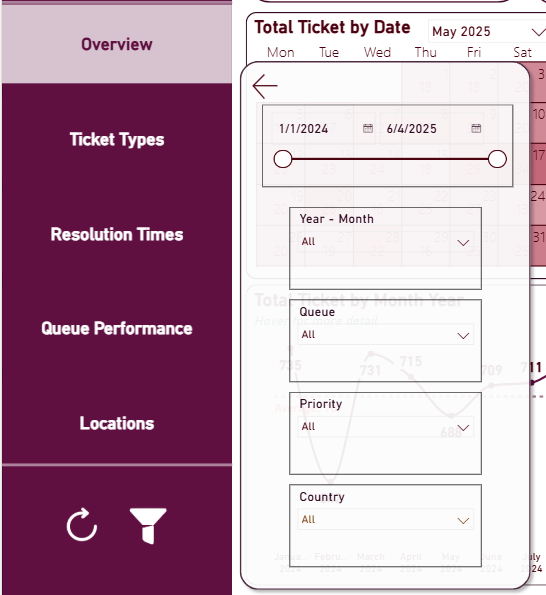
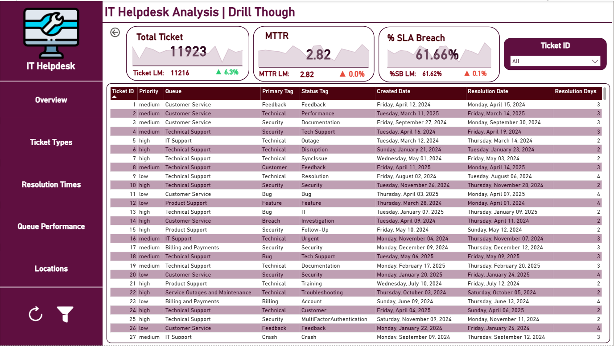
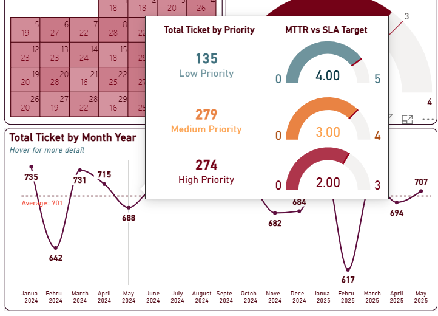
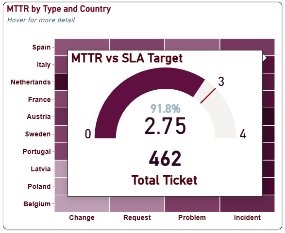
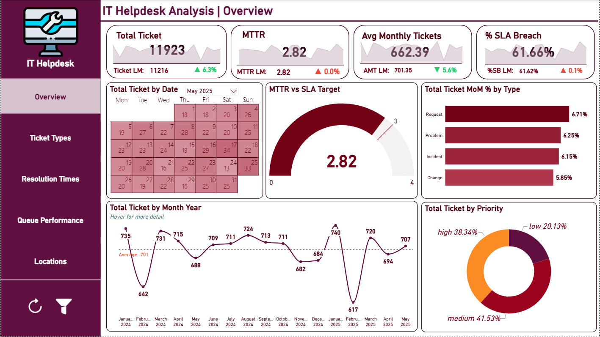
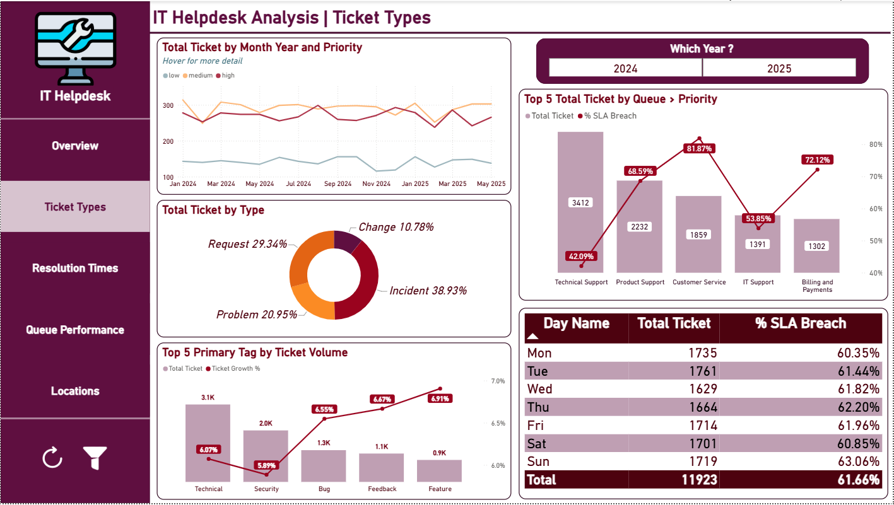
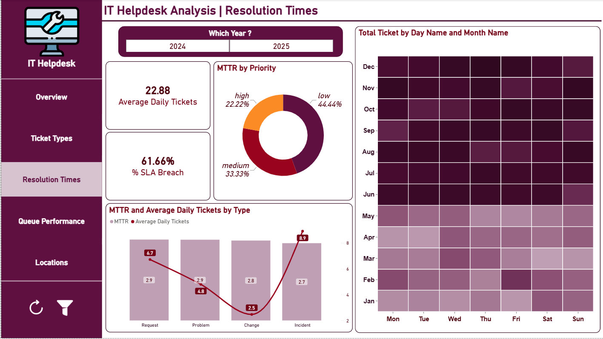
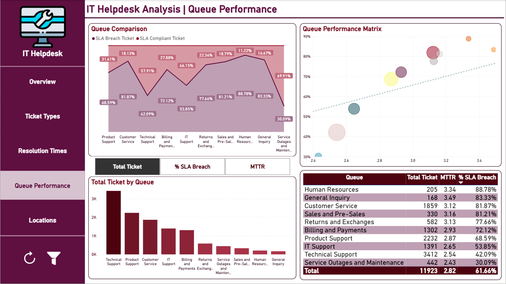
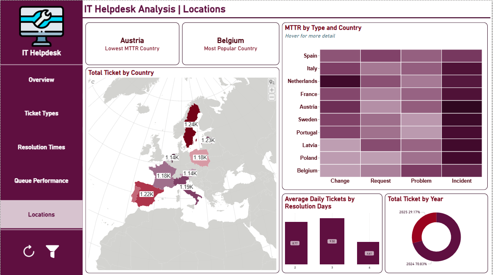

---

  

# 📊 {{PROJECT_TITLE}} | Power BI

_{{ONE_LINE_SUMMARY}}_

- 🎯 **Business Question:** {{BUSINESS_QUESTION}}
- 🏬 **Domain:** {{DOMAIN}}
- 🛠️ **Tools:** Power BI

👤 Author: Bạch Minh Nam

---

## 📑 Table of Contents
1. [📌 Background & Overview](#-background--overview)
2. [📂 Dataset Description & Data Structure](#-dataset-description--data-structure)
3. [🧠 Design Thinking Process](#-design-thinking-process)
4. [📊 Key Insights & Visualizations](#-key-insights--visualizations)
5. [🔎 Final Conclusion & Recommendations](#-final-conclusion--recommendations)

---

## 📌 Background & Overview

### Objective

{{COMPANY_CONTEXT_PARAGRAPH}}

The {{STAKEHOLDER}} needs a dashboard to answer {{N}} main questions:

✔️ **{{QUESTION_1_TITLE}}:** {{QUESTION_1_DETAIL}}

✔️ **{{QUESTION_2_TITLE}}:** {{QUESTION_2_DETAIL}}

✔️ **{{QUESTION_3_TITLE}}:** {{QUESTION_3_DETAIL}}

{{PROJECT_PURPOSE_PARAGRAPH}}

### 👤 Who is this project for?

✔️ {{AUDIENCE_1}} - {{AUDIENCE_1_REASON}}

✔️ {{AUDIENCE_2}} - {{AUDIENCE_2_REASON}}

✔️ {{AUDIENCE_3}} - {{AUDIENCE_3_REASON}}

---

## 📂 Dataset Description & Data Structure

## 📌 1. Data Source & Original Structure
* **Source:** IT Support Ticket Desk 
* **Format:** Flat Excel file (`.xlsx`)
* **Volume:** 1 single sheet (`Data`) containing **11,923 rows × 20 columns**
* **Original Grain:** 1 row = 1 ticket

### 🗂️ Original Data Dictionary
Before transformation, the raw flat dataset mixed transactional ticket information, routing attributes, geographic coordinates, and multiple category tags into a single table:

| Column Name | Description |
| :--- | :--- |
| **Ticket ID** | Unique identifier for each ticket |
| **Date** | Date the ticket was created |
| **Resolution Date** | Calculated expected resolution date |
| **Subject** | Subject line of the support ticket |
| **Body** | Main body of the ticket request or issue |
| **Answer** | Support response or follow-up provided |
| **Type** | Type of request (e.g., Request, Problem) |
| **Queue** | Support queue handling the ticket |
| **Priority** | Priority level assigned to the ticket |
| **Primary Tag** | Primary classification of the ticket |
| **Secondary Tag** | Secondary classification for added context |
| **Category Tag** | General category tag for classification |
| **Technical Tag** | Specific technical classification tag |
| **Status Tag** | Status or nature of the issue |
| **Resolution Tag** | Assigned resolution classification |
| **Documentation Tag** | Documentation reference tag |
| **Additional Tag** | Additional contextual or tagging info |
| **Country** | Country of origin for the ticket |
| **Latitude** | Latitude of the originating location |
| **Longitude** | Longitude of the originating location |

---

## ⚙️ 2. Data Processing & Modeling Decisions
To convert this flat file into a high-performance **Star Schema** within Power BI, the original structure was modified through the following architectural decisions:

### A. Extracting Standard Dimension Tables
Purely descriptive string columns were decoupled from the fact table into normalized dimension tables to reduce redundancy, maximize file compression, and optimize filtering performance:

| Target Dimension | Original Column(s) | Transformation Reason & Logic |
| :--- | :--- | :--- |
| **Dim_Queue** | `Queue` | Prevents repetitive string storage; optimizes slicing/filtering performance. |
| **Dim_Priority** | `Priority` | Standardizes and restricts values into 3 clean categories: *Low / Medium / High*. |
| **Dim_Type** | `Type` | Standardizes data quality into 4 distinct request types: *Request / Problem / Incident / Change*. |
| **Dim_Country** | `Country`, `Latitude`, `Longitude` | Consolidates related spatial attributes into a singular geographic lookup dimension. |

### B. Advanced Tag Handling (Many-to-Many Normalization)
The raw dataset contained **8 separate tag columns** (`Primary`, `Secondary`, `Category`, `Technical`, `Status`, `Resolution`, `Documentation`, `Additional`). Since a single ticket can hold multiple tag designations, mapping them horizontally causes data sparsity and restricts reporting flexibility.
1. **Unpivot Process:** Unpivoted all 8 tag columns into two standardized key-value columns: `Tag Name` and `Tag Type`.
2. **Dimension Creation (`Dim_Tag`):** Removed duplicates from the unpivoted columns and assigned a unique surrogate `Tag ID` to build a centralized tag dictionary.
3. **Bridge Table (`Bridge_Ticket_Tag`):** Constructed a junction table mapped with `Ticket ID` and `Tag ID`. This cleanly resolves the **Many-to-Many relationship** between tickets and tags while strictly preserving the transactional grain of the fact table (**1 row = 1 ticket**).

### C. Time Intelligence
* **Dim_Date:** A dedicated calendar table generated via DAX, established with a 1-to-many relationship linking back to the `Date` column inside the fact table to unlock complex time-intelligence calculations (YoY, MoM, rolling totals).

---

## 📊 3. Final Star Schema Structure & Relationships

### 1️⃣ Tables Used
The finalized data model consists of **8 total tables** (1 Fact table, 1 Bridge table, 6 Dimension tables):
* **Fact_Ticket** - Holds core transactional details, messages, answers, and time metrics (Grain: 1 row = 1 unique ticket).
* **Dim_Tag** - The comprehensive consolidated tag directory.
* **Bridge_Ticket_Tag** - Intersection bridge to facilitate many-to-many tag relations.
* **Dim_Date** - DAX calendar dimensions.
* **Dim_Queue / Dim_Priority / Dim_Type / Dim_Country** - Outrigger lookup metrics used to slice analytical charts.

### 2️⃣ Core Table Schemas

#### Table: Fact_Ticket (Fact Table)
| Column Name | Description |
| :--- | :--- |
| Ticket ID | **Primary Key.** Unique identifier for each support ticket. |
| Subject | Subject line of the support ticket. |
| Body | Main body text detailing the customer's request or issue. |
| Answer | Support response or resolution text provided to the user. |
| Date | Date the ticket was created (Foreign Key to `Dim_Date`). |
| Resolution Date | Calculated expected resolution date. |
| Queue ID / Priority ID / Type ID / Country ID | Foreign Keys linking to respective lookup dimension tables. |

#### Table: Dim_Tag (Dimension Table)
| Column Name | Description |
| :--- | :--- |
| Tag ID | **Primary Key.** Unique auto-generated identifier for each distinct tag. |
| Tag Name | The specific tag string value (e.g., "Integration", "Billing", "Sales"). |
| Tag Type | The original functional column category of the tag (e.g., Primary, Technical, Status). |

#### Table: Bridge_Ticket_Tag (Bridge Table)
| Column Name | Description |
| :--- | :--- |
| Ticket ID | Foreign Key linking back to `Fact_Ticket`. |
| Tag ID | Foreign Key linking back to `Dim_Tag`. |

### 3️⃣ Data Relationships
* **Dim_Date** → **Fact_Ticket**: 1-to-Many (joined on `Date`)
* **Dim_Queue / Dim_Priority / Dim_Type / Dim_Country** → **Fact_Ticket**: 1-to-Many (joined on respective dimension IDs)
* **Fact_Ticket** → **Bridge_Ticket_Tag**: 1-to-Many (joined on `Ticket ID`)
* **Dim_Tag** → **Bridge_Ticket_Tag**: 1-to-Many (joined on `Tag ID`)

  

## 🧠 Design Thinking Process

This project followed the Design Thinking framework across 3 main steps: Empathize, Define Point of View, and Ideate.

### 1️⃣ Empathize - Understanding the Stakeholder

| Question | Answer |
|---|---|
| **Who views this dashboard?** | {{STAKEHOLDER}} |
| **What problem does it solve?** | {{PROBLEM_SOLVED}} |
| **When & where is it used?** | {{USAGE_CONTEXT}} |
| **Why is this analysis needed?** | {{WHY_NEEDED}} |
| **How do they decide?** | {{HOW_DECIDE}} |
| **Pains** | {{PAINS}} |
| **Gains** | {{GAINS}} |
| **Key Questions to Answer** | • {{KEY_Q1}} • {{KEY_Q2}} • {{KEY_Q3}} • {{KEY_Q4}} • {{KEY_Q5}} |

### 2️⃣ Define Point of View - Choosing the Right Angles

| Point of View | Description | Why the stakeholder cares |
|---|---|---|
| **{{POV_1}}** | {{POV_1_DESC}} | {{POV_1_WHY}} |
| **{{POV_2}}** | {{POV_2_DESC}} | {{POV_2_WHY}} |
| **{{POV_3}}** | {{POV_3_DESC}} | {{POV_3_WHY}} |

**Northstar Metrics:**

| Northstar 1 | Northstar 2 |
|---|---|
| **{{NORTHSTAR_1_NAME}}** | **{{NORTHSTAR_2_NAME}}** |
| Formula: `{{NORTHSTAR_1_FORMULA}}` | Formula: `{{NORTHSTAR_2_FORMULA}}` |
| Success when: {{NORTHSTAR_1_SUCCESS}} | Success when: {{NORTHSTAR_2_SUCCESS}} |
| Why this metric: {{NORTHSTAR_1_WHY}} | Why this metric: {{NORTHSTAR_2_WHY}} |

### 3️⃣ Ideate - Structuring the Dashboard

| | **Page 1: {{PAGE_1_NAME}}** | **Page 2: {{PAGE_2_NAME}}** | **Page 3: {{PAGE_3_NAME}}** |
|---|---|---|---|
| **Layer 0 (Scorecards)** | {{P1_LAYER0}} | {{P2_LAYER0}} | {{P3_LAYER0}} |
| **Layer 1 (1-dimension breakdown)** | {{P1_LAYER1}} | {{P2_LAYER1}} | {{P3_LAYER1}} |
| **Layer 2 (2-dimension breakdown)** | {{P1_LAYER2}} | {{P2_LAYER2}} | {{P3_LAYER2}} |

---

## ⚒️ Main Process

1️⃣ **Connect & Load Data** - {{STEP_1_DESC}}

2️⃣ **Data Modeling** - {{STEP_2_DESC}}

3️⃣ **DAX Measures** - {{STEP_3_DESC}}

4️⃣ **Power BI Visualization** - {{STEP_4_DESC}}

---

## 📊 Key Insights & Visualizations

### 🔍 Dashboard Preview

> **⚙️ Advanced Power BI Features Used**
>
> - 🔖 **Bookmarks & Button** - A hidden filter panel is toggled by clicking the filter icon on the bottom-left of every page. The panel slides in with: Date Range slider (1/1/2024 – 6/4/2025), and slicers for Year-Month, Queue, Priority, and Country - applied simultaneously across the report page.
>
> 

>
> - 🔍 **Drill Through** - Click on any data point across all pages to drill into the `Drill_Though` detail page, showing a full ticket-level table with Ticket ID, Priority, Queue, Primary Tag, Status Tag, Created Date, Resolution Date, and Resolution Days.
>
> 

>
> - 💬 **Tooltips** - Hover over data points on trend charts to reveal additional context without cluttering the main view.
>
> 
 

>
> - 🔙 **Back Button** - A navigation arrow on the top-left of the Drill Through page returns the user to the previous report page.

---

#### 1️⃣ Page 1 - Overview

  

📌 **Analysis 1:**

- **Observation:** The helpdesk handled **11,923 total tickets** (+6.3% vs. last month) with an MTTR of **2.82 days** - right at the SLA target boundary. The most alarming metric is **% SLA Breach at 61.66%**, meaning nearly 2 in 3 tickets are resolved outside the agreed timeframe. Monthly ticket volume fluctuated around an average of **701 tickets/month**, dipping to a low of 617 in January 2025 before recovering to 707 in May 2025. By priority, **medium tickets dominate (41.53%)**, followed by high (38.34%) and low (20.13%). All ticket types showed positive MoM growth (5.85%–6.71%), indicating consistently rising workload.

- **Recommendation:**
  - 🔴 **SLA Breach at 61.66% is critical and requires immediate action.** Over half of all tickets are resolved late - this is a systemic issue, not an isolated one. A root-cause review across queues and ticket types is the first priority.
  - 🟡 **Investigate the Jan 2025 volume drop (617 tickets).** An unusual dip may indicate underreporting, a system issue, or a genuine reduction in requests - understanding the cause helps validate data reliability.
  - 🟢 **Monitor the MoM growth trend closely.** All ticket types are growing at ~6% monthly - capacity planning should be adjusted proactively before volume outpaces team bandwidth.

---

#### 2️⃣ Page 2 - Ticket Types

  

📌 **Analysis 2:**

- **Observation:** **Incident tickets lead at 38.93%** of total volume, followed by Request (29.34%), Problem (20.95%), and Change (10.78%). By primary tag, **Technical issues are the most frequent (3.1K)**, with Security second (2.0K) - both also showing the highest ticket growth rates (6.07% and 5.89%). Among queues, **Customer Service has the highest SLA Breach at 81.87%** despite not being the busiest queue, while **Technical Support - the largest queue (3,412 tickets) - has a relatively lower breach rate at 42.09%**. SLA Breach rates are consistently high across all days of the week (60–63%), with **Sunday being the worst at 63.06%**.

- **Recommendation:**
  - 🔴 **Customer Service queue needs urgent attention.** 81.87% SLA Breach on 1,859 tickets is the worst among high-volume queues - review staffing levels, escalation paths, and resolution workflows specific to this queue.
  - 🟡 **Weekend SLA performance is slightly worse - consider weekend coverage.** Sunday breach rate (63.06%) is the highest of the week, suggesting support capacity drops on weekends relative to incoming volume.
  - 🟢 **Technical Support is managing scale relatively well (42.09% breach).** As the largest queue, its comparatively lower breach rate suggests better processes - these practices should be documented and replicated in underperforming queues.

> 📋 For ticket-level detail by type, queue, and tag - use the **Drill Through** feature on any data point.

---

#### 3️⃣ Page 3 - Resolution Times

  

📌 **Analysis 3:**

- **Observation:** Average Daily Tickets stand at **22.88** with an overall MTTR of **2.82 days** and SLA Breach at **61.66%**. Breaking down by ticket type, **Incident tickets have the highest average daily volume (8.9) but the lowest MTTR (2.7 days)**, suggesting the team prioritizes and resolves incidents quickly. **Request tickets take the longest (MTTR 2.9)** despite moderate daily volume (6.7). By priority, **low-priority tickets account for the largest MTTR share (44.44%)**, indicating they are frequently deprioritized and left to age. The heatmap shows ticket volume is heaviest in the **Sep–Dec 2024 period**, with lighter loads in early 2024 and early 2025.

- **Recommendation:**
  - 🔴 **Low-priority tickets are aging unacceptably.** At 44.44% of MTTR distribution, low-priority tickets are contributing significantly to overall SLA breach - set maximum age thresholds to prevent indefinite deferral.
  - 🟡 **Request-type tickets need process streamlining.** Highest MTTR (2.9 days) with substantial daily volume (6.7) - review whether request workflows have unnecessary approval steps causing delays.
  - 🟢 **The incident handling model is working - replicate it.** Lowest MTTR (2.7) despite highest daily volume shows effective triage and escalation. Apply the same prioritization logic to Request and Problem queues.

---

#### 4️⃣ Page 4 - Queue Performance

  

📌 **Analysis 4:**

- **Observation:** The Queue Performance Matrix clearly separates queues into two clusters. **High-breach queues** (Human Resources 88.78%, General Inquiry 83.33%, Customer Service 81.87%) all show MTTR above 3.0 days - slow and non-compliant. **Low-breach queues** (Service Outages & Maintenance 30.09%, Technical Support 42.09%, IT Support 53.85%) resolve tickets faster (MTTR 2.43–2.65 days). **Technical Support is by far the highest-volume queue (3,412 tickets)** but maintains one of the best breach rates. The queue comparison chart confirms that SLA Compliant tickets dominate in Technical Support, while breach tickets dominate in HR and General Inquiry.

- **Recommendation:**
  - 🔴 **Human Resources queue is the worst performer (88.78% breach, MTTR 3.34).** With only 205 tickets, this is not a volume problem - it is a process or staffing problem. Immediate intervention is needed.
  - 🟡 **General Inquiry (83.33% breach) likely lacks clear ownership.** Vague ticket categorization often leads to delays - define clear routing rules and assign dedicated owners for this queue.
  - 🟢 **Use Technical Support and Service Outages as benchmarks.** Both handle meaningful volume with low breach rates - conduct a process audit on these queues and share best practices with underperforming ones.

> 📋 Click any queue bar to drill through to individual ticket records for deeper investigation.

---

#### 5️⃣ Page 5 - Locations

  

📌 **Analysis 5:**

- **Observation:** The dataset covers **10 European countries**, with **Belgium generating the most tickets** (~1.23–1.24K range) and **Austria having the lowest MTTR** - making it the fastest-resolving country. Ticket volume is relatively evenly distributed across countries (1.14K–1.24K each), suggesting consistent global demand. The MTTR heatmap by Type and Country shows **Netherlands and Spain tend to have darker shades across all ticket types**, indicating slower resolution times. Tickets resolved in **2 days account for the highest average daily ticket count (8.77)**, while 4-day resolutions have the fewest (4.61) - confirming most tickets are being resolved within 3 days when compliant. 2024 dominates total ticket volume at **70.83%** vs 29.17% for 2025 (partial year).

- **Recommendation:**
  - 🔴 **Investigate Netherlands and Spain for systemic resolution delays.** The MTTR heatmap shows consistently darker cells across all ticket types - this points to a country-level staffing or process gap, not a ticket-type-specific issue.
  - 🟡 **Study Austria's low-MTTR model and replicate it.** As the fastest-resolving country, Austria's local processes, team structure, or escalation paths may offer replicable lessons for slower countries.
  - 🟢 **Standardize SLAs and workflows across all countries.** Even distribution of ticket volume means no country has a significantly higher workload - performance differences are driven by process quality, not scale.

---

## 🔎 Final Conclusion & Recommendations

📍 Key Takeaways:

✔️ **A 61.66% SLA Breach rate is the single most urgent issue in the entire system.** Nearly two-thirds of all tickets are resolved outside SLA - this is not a minor inefficiency but a fundamental service delivery failure that requires structural intervention, not just monitoring.

✔️ **The problem is not volume - it is queue and process quality.** Technical Support handles the most tickets (3,412) yet maintains one of the lowest breach rates (42.09%). Meanwhile, Human Resources (205 tickets, 88.78% breach) and General Inquiry (168 tickets, 83.33% breach) struggle despite low volume. More tickets do not cause more breaches - poor processes do.

✔️ **Low-priority tickets are a hidden SLA drain.** Representing 44.44% of MTTR distribution, low-priority tickets are routinely deprioritized until they breach SLA. Setting maximum age limits and auto-escalation rules for aging low-priority tickets would materially reduce overall breach rates.

✔️ **Geographic performance gaps need country-level action plans.** Netherlands and Spain consistently show higher MTTR across all ticket types, while Austria resolves fastest. A structured knowledge-sharing program from high-performing to low-performing countries is a low-cost, high-impact lever.

✔️ **Incident management is working - scale the model.** Incidents have the highest daily volume yet the lowest MTTR (2.7 days), proving the triage and escalation process works. Applying the same discipline to Request and Problem ticket workflows is the clearest path to reducing overall MTTR and SLA breach rates system-wide.
