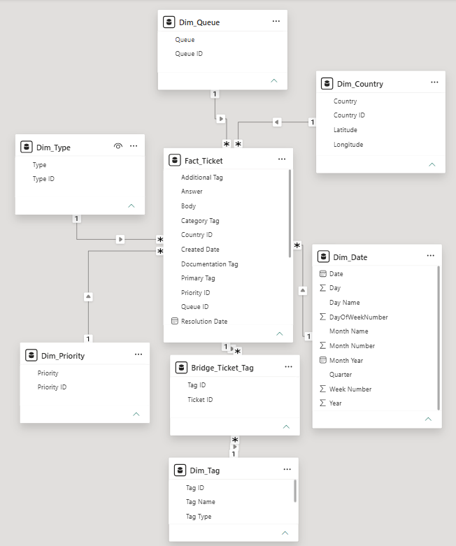

---

  

# 📊 {{PROJECT_TITLE}} | Power BI

_{{ONE_LINE_SUMMARY}}_

- 🎯 **Business Question:** {{BUSINESS_QUESTION}}
- 🏬 **Domain:** {{DOMAIN}}
- 🛠️ **Tools:** Power BI

👤 Author: {{AUTHOR}}

📅 Date: {{DATE}}

---

## 📑 Table of Contents
1. [📌 Background & Overview](#-background--overview)
2. [📂 Dataset Description & Data Structure](#-dataset-description--data-structure)
3. [🧠 Design Thinking Process](#-design-thinking-process)
4. [📊 Key Insights & Visualizations](#-key-insights--visualizations)
5. [🔎 Final Conclusion & Recommendations](#-final-conclusion--recommendations)

---

## 📌 Background & Overview

### Objective

{{COMPANY_CONTEXT_PARAGRAPH}}

The {{STAKEHOLDER}} needs a dashboard to answer {{N}} main questions:

✔️ **{{QUESTION_1_TITLE}}:** {{QUESTION_1_DETAIL}}

✔️ **{{QUESTION_2_TITLE}}:** {{QUESTION_2_DETAIL}}

✔️ **{{QUESTION_3_TITLE}}:** {{QUESTION_3_DETAIL}}

{{PROJECT_PURPOSE_PARAGRAPH}}

### 👤 Who is this project for?

✔️ {{AUDIENCE_1}} - {{AUDIENCE_1_REASON}}

✔️ {{AUDIENCE_2}} - {{AUDIENCE_2_REASON}}

✔️ {{AUDIENCE_3}} - {{AUDIENCE_3_REASON}}

---

## 📂 Dataset Description & Data Structure

### 📌 Data Source
- Source: {{DATA_SOURCE}}
- Format: {{DATA_FORMAT}}

### 📊 Data Structure & Relationships

#### 1️⃣ Tables Used

The dataset has **{{N_TABLES}} tables**:

- **{{TABLE_1}}** - {{TABLE_1_DESC}}
- **{{TABLE_2}}** - {{TABLE_2_DESC}}
- **{{TABLE_3}}** - {{TABLE_3_DESC}}

#### 2️⃣ Table Schema

**Table: {{TABLE_1}}** ({{TABLE_1_ROLE}})

| Column Name | Description |
|---|---|
| {{COLUMN}} | {{DESCRIPTION}} |

**Table: {{TABLE_2}}**

| Column Name | Description |
|---|---|
| {{COLUMN}} | {{DESCRIPTION}} |

**Table: {{TABLE_3}}**

| Column Name | Description |
|---|---|
| {{COLUMN}} | {{DESCRIPTION}} |

#### 3️⃣ Data Relationships

The {{N_TABLES}} tables are connected as follows:

- **{{TABLE_X}} → {{TABLE_Y}}**: {{RELATIONSHIP_DESC}} (joined on `{{KEY}}`)
- **{{TABLE_Y}} → {{TABLE_Z}}**: {{RELATIONSHIP_DESC}} (joined on `{{KEY}}`)

  

---

## 🧠 Design Thinking Process

This project followed the Design Thinking framework across 3 main steps: Empathize, Define Point of View, and Ideate.

### 1️⃣ Empathize - Understanding the Stakeholder

| Question | Answer |
|---|---|
| **Who views this dashboard?** | {{STAKEHOLDER}} |
| **What problem does it solve?** | {{PROBLEM_SOLVED}} |
| **When & where is it used?** | {{USAGE_CONTEXT}} |
| **Why is this analysis needed?** | {{WHY_NEEDED}} |
| **How do they decide?** | {{HOW_DECIDE}} |
| **Pains** | {{PAINS}} |
| **Gains** | {{GAINS}} |
| **Key Questions to Answer** | • {{KEY_Q1}} • {{KEY_Q2}} • {{KEY_Q3}} • {{KEY_Q4}} • {{KEY_Q5}} |

### 2️⃣ Define Point of View - Choosing the Right Angles

| Point of View | Description | Why the stakeholder cares |
|---|---|---|
| **{{POV_1}}** | {{POV_1_DESC}} | {{POV_1_WHY}} |
| **{{POV_2}}** | {{POV_2_DESC}} | {{POV_2_WHY}} |
| **{{POV_3}}** | {{POV_3_DESC}} | {{POV_3_WHY}} |

**Northstar Metrics:**

| Northstar 1 | Northstar 2 |
|---|---|
| **{{NORTHSTAR_1_NAME}}** | **{{NORTHSTAR_2_NAME}}** |
| Formula: `{{NORTHSTAR_1_FORMULA}}` | Formula: `{{NORTHSTAR_2_FORMULA}}` |
| Success when: {{NORTHSTAR_1_SUCCESS}} | Success when: {{NORTHSTAR_2_SUCCESS}} |
| Why this metric: {{NORTHSTAR_1_WHY}} | Why this metric: {{NORTHSTAR_2_WHY}} |

### 3️⃣ Ideate - Structuring the Dashboard

| | **Page 1: {{PAGE_1_NAME}}** | **Page 2: {{PAGE_2_NAME}}** | **Page 3: {{PAGE_3_NAME}}** |
|---|---|---|---|
| **Layer 0 (Scorecards)** | {{P1_LAYER0}} | {{P2_LAYER0}} | {{P3_LAYER0}} |
| **Layer 1 (1-dimension breakdown)** | {{P1_LAYER1}} | {{P2_LAYER1}} | {{P3_LAYER1}} |
| **Layer 2 (2-dimension breakdown)** | {{P1_LAYER2}} | {{P2_LAYER2}} | {{P3_LAYER2}} |

---

## ⚒️ Main Process

1️⃣ **Connect & Load Data** - {{STEP_1_DESC}}

2️⃣ **Data Modeling** - {{STEP_2_DESC}}

3️⃣ **DAX Measures** - {{STEP_3_DESC}}

4️⃣ **Power BI Visualization** - {{STEP_4_DESC}}

---

## 📊 Key Insights & Visualizations

### 🔍 Dashboard Preview

#### 1️⃣ Page 1 - {{PAGE_1_NAME}}

  

📌 **Analysis 1:**

- **Observation:** {{PAGE_1_OBSERVATION}}

- **Recommendation:**
  - 🔴 **{{REC_1_TITLE}}** {{REC_1_DETAIL}}
  - 🟡 **{{REC_2_TITLE}}** {{REC_2_DETAIL}}
  - 🟢 **{{REC_3_TITLE}}** {{REC_3_DETAIL}}

#### 2️⃣ Page 2 - {{PAGE_2_NAME}}

  

📌 **Analysis 2:**

- **Observation:** {{PAGE_2_OBSERVATION}}

- **Recommendation:**
  - 🔴 **{{REC_1_TITLE}}** {{REC_1_DETAIL}}
  - 🟡 **{{REC_2_TITLE}}** {{REC_2_DETAIL}}
  - 🟢 **{{REC_3_TITLE}}** {{REC_3_DETAIL}}

#### 3️⃣ Page 3 - {{PAGE_3_NAME}}

  

📌 **Analysis 3:**

- **Observation:** {{PAGE_3_OBSERVATION}}

- **Recommendation:**
  - 🔴 **{{REC_1_TITLE}}** {{REC_1_DETAIL}}
  - 🟡 **{{REC_2_TITLE}}** {{REC_2_DETAIL}}
  - 🟢 **{{REC_3_TITLE}}** {{REC_3_DETAIL}}

---

## 🔎 Final Conclusion & Recommendations

📍 Key Takeaways:

✔️ **{{TAKEAWAY_1_TITLE}}** {{TAKEAWAY_1_DETAIL}}

✔️ **{{TAKEAWAY_2_TITLE}}** {{TAKEAWAY_2_DETAIL}}

✔️ **{{TAKEAWAY_3_TITLE}}** {{TAKEAWAY_3_DETAIL}}

✔️ **{{TAKEAWAY_4_TITLE}}** {{TAKEAWAY_4_DETAIL}}

✔️ **{{TAKEAWAY_5_TITLE}}** {{TAKEAWAY_5_DETAIL}}
